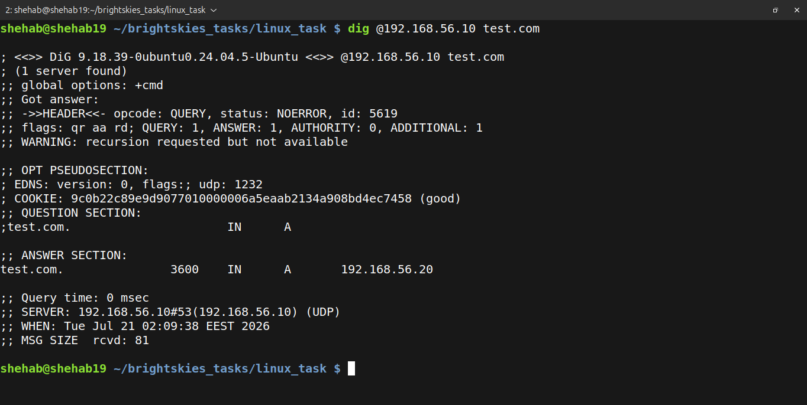
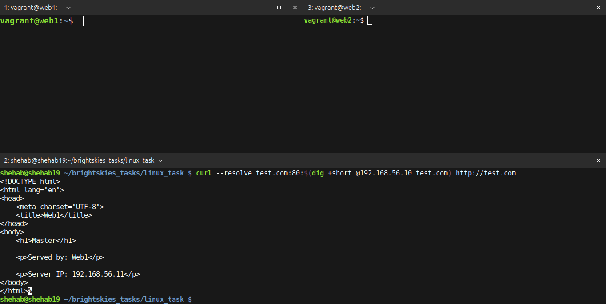
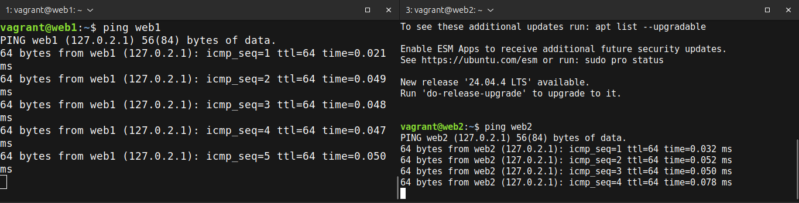
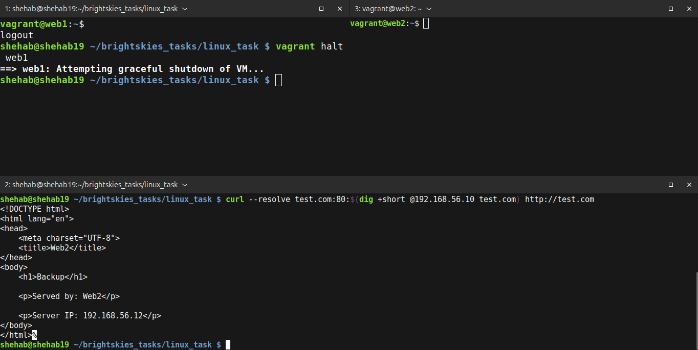

# Highly Available Web Infrastructure

## Tech Stack

- Ubuntu 22.04 LTS
- Vagrant
- VirtualBox
- NGINX
- Keepalived (VRRP)
- BIND9 DNS
- Bash

## Flow

```text
Client → BIND9 DNS → Virtual IP → Web1 (MASTER)
                              └→ Web2 (BACKUP)
```

### 1. Start All Machines

```bash
vagrant up
```

### 2. Test DNS Resolution

```bash
dig @192.168.56.10 test.com
```

### 3. Send a Request to the Master

```bash
curl --resolve test.com:80:$(dig +short @192.168.56.10 test.com) http://test.com
```

### 4. Stop the Master to Trigger Failover

```bash
vagrant halt web1
```

### 5. Send the Request Again

```bash
curl --resolve test.com:80:$(dig +short @192.168.56.10 test.com) http://test.com
```

The same virtual IP now serves the response from `web2`.

## Results

| Machine | Role | IP Address |
| --- | --- | --- |
| `dns1` | BIND9 DNS server | `192.168.56.10` |
| `web1` | NGINX master | `192.168.56.11` |
| `web2` | NGINX backup | `192.168.56.12` |
| Virtual IP | Keepalived service address | `192.168.56.20` |

- `test.com` and `www.test.com` resolve to the virtual IP `192.168.56.20`.
- NGINX is served by `web1` as the master node.
- Traffic automatically fails over to `web2` when `web1` is unavailable.

### DNS Lookup



### Master Server



### Connectivity Test



### Automatic Failover


